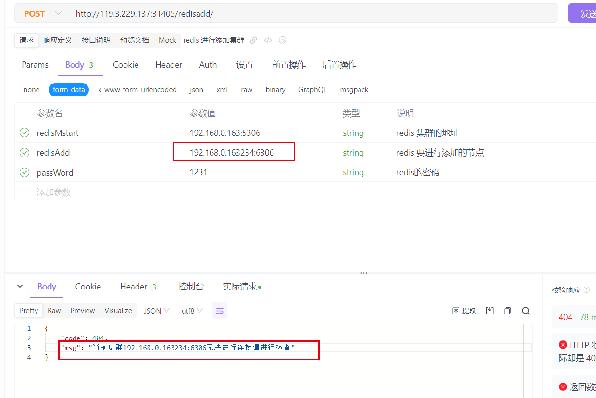
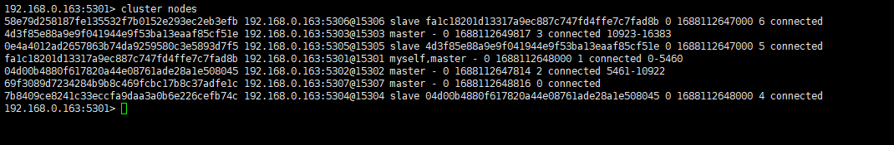
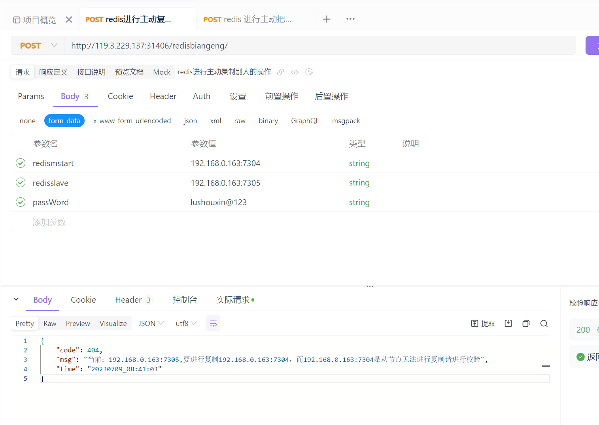
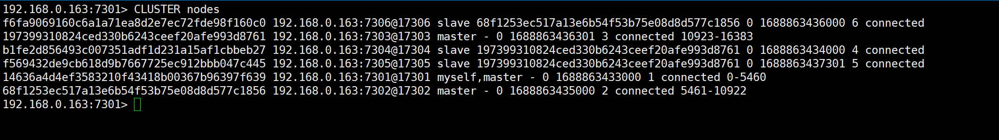
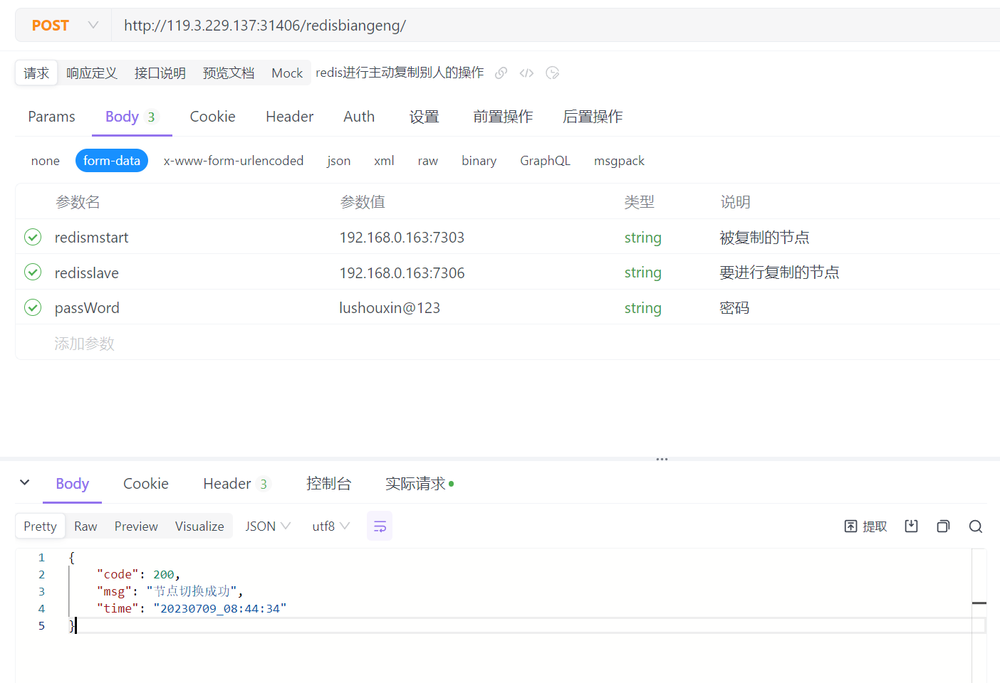
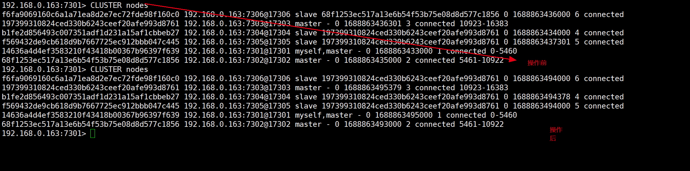

# 使用说明
# 使用视频：
```shell
链接：https://pan.baidu.com/s/1BJ1ZTcmIHyXkobCRsCVmqQ?pwd=ge07 
提取码：ge07 
--来自百度网盘超级会员V5的分享
```
## 在redis 进群中进行添加redis 节点
!!! 注意请求建议使用工具进行获取不建议使用命令：# 这边建议使用工具进行传入参数
### 传入数据出现的问题
传入空数据出现如下报错：

### redis节点无法进行连接会出现如下报错：
```shell
curl --location --request POST 'http://119.3.229.137:31405/redisadd/' \
--header 'User-Agent: Apifox/1.0.0 (https://apifox.com)' \
--form 'redisMstart="<redisMstart>"' \
--form 'redisAdd="<redisAdd>"' \
--form 'passWord="<passWord>"'
```

### 这边进行传入添加的节点如图所示
```shell
# 这边建议使用工具进行传入参数
curl --location --request POST 'http://119.3.229.137:31405/redisadd/' \
--header 'User-Agent: Apifox/1.0.0 (https://apifox.com)' \
--form 'redisMstart="<redisMstart>"' \
--form 'redisAdd="<redisAdd>"' \
--form 'passWord="<passWord>"'
```

### 这边准备测试正确的日志
添加前

添加后
```shell
curl --location --request POST 'http://119.3.229.137:31405/redisadd/' \
--header 'User-Agent: Apifox/1.0.0 (https://apifox.com)' \
--form 'redisMstart="<redisMstart>"' \
--form 'redisAdd="<redisAdd>"' \
--form 'passWord="<passWord>"'
```


## 进行删除redis节点
### 注意这边只删除redis 从节点保障系统的正常运转：
### 传入参数前
```shell
curl --location --request POST 'http://119.3.229.137:31405/redisdelete/' \
--header 'User-Agent: Apifox/1.0.0 (https://apifox.com)' \
--form 'redisMstart="<redisMstart>"' \
--form 'redisDelete="<redisDelete>"' \
--form 'passWord="<passWord>"'
```
### 删除前:


### 当删除的节点是主的时候：

### 删除从的时候：


## redis 进行把从节点切换成主节点：
### 传入参数：
```shell
curl --location --request POST 'http://119.3.229.137:31405/redisfailover/' \
--header 'User-Agent: Apifox/1.0.0 (https://apifox.com)' \
--form 'redisSlave="<redisSlave>"' \
--form 'passWord="<passWord>"'
```
### 执行如下：


# 进行节点复制：

```shell
curl --location --request POST 'http://119.3.229.137:31406/redisbiangeng/' \
--header 'User-Agent: Apifox/1.0.0 (https://apifox.com)' \
--form 'redismstart="<redismstart>"' \
--form 'redisslave="<redisslave>"' \
--form 'passWord="<passWord>"'
```


## 错误是数据



## 正确的数据：
### 操作之前的验证：

### 进行复制节点：


### 验证后：
